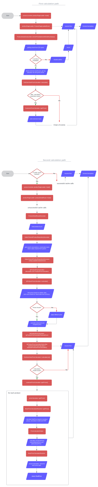

# Flowchart

<figure><figcaption></figcaption></figure>

**First calculation path, always taken:**

productController::productPageLoader->load()\
productPageLoader: ProductPageLoadedEvent\
WebInterpneuB2B/src/AdHoc/Business/Product/ProductDetailsSubscriber::enrichPriceOptionsWithAdHocStatus()\
getting result from EDI query\
checking if product available (if not, disabling adHoc, return).&#x20;

If available, block external warehouse, get tax, calculate net and gross prices. Then, large part of the calculations here:

WebInterpneuB2B/src/OfferManagement/OfferPriceCalculation/Business/EndUserViewPriceCalculator->calculate()

getting offer\_calculation extension. If it exists, getting price from here: WebInterpneuB2B/src/OfferManagement/OfferPriceCalculation/CustomerPrice/CustomerPriceCalculator->getPrice() and adding extension back

by chain of events we get back to productPageLoader and then render frontend

**Second calculation path, taken only after redis cache flush:**

starts with ProductController and ProductPageLoader->load(), but this time, long before dispatching ProductPageLoadedEvent, productDetailRoute->load() is called, goes through cache calls (fifteen of them) and arrives at WebInterpneuCore/src/Product/Business/Route/ProductDetailRouteDecorator, where product is loaded by id. Meanwhile in WebInterpneuB2B/src/B2B/Stock/Repository/SalesChannelProductRepositoryDecorator some search associations are added, stock recalculated, sales channel is returned from parent and EntityLoadedContainerEvent dispatched. From there script arrives at WebInterpneuCore/src/Price/Business/PriceCalculator/IpProductPriceCalculator which decorates core ProductPriceCalculator. This is where the key parts of calculation begin.

IpProductPriceCalculator->calculate() first finds prices based on debtor data. From the extensive list of (custom) prices from the database (ip\_price) a few are picked based on stock data and currency. If nothing is found, fallback price is applied.

After that, advance and cheapest prices are calculated, then IpProductPriceCalculatorPayloadEvent dispatched.

Which is listened for in WebInterpneuB2B/src/OfferManagement/OfferPriceCalculation/Subscriber/IpProductPriceCalculatorSubscriber, and thus endUserViewPriceCalculator->

endUserProductsPriceCalculator() is called. In WebInterpneuB2B/src/OfferManagement/OfferPriceCalculation/Business/EndUserViewPriceCalculator->calculateList() first check for a calculation model is performed, and if successful, customerPriceCalculator->getPrices() gets called.

WebInterpneuB2B/src/OfferManagement/OfferPriceCalculation/CustomerPrice/CustomerPriceCalculator->getPrices() calls priceCalculator->getPrice() for each product which in turn calls WebInterpneuB2B/src/OfferManagement/OfferPriceCalculation/CustomerPrice/Resolvers/BasePriceCalculatorResolver->getPrice() where finalPrice is calculated based on product group, calculation model and RRP. This one is passed through WebInterpneuB2B/src/OfferManagement/OfferPriceCalculation/CustomerPrice/Resolvers/PriceCalculatorHelper, where there are calculated ownStockPrice, externalStockPrice and adHocStockPrice. Actual calculation takes place in WebInterpneuB2B/src/OfferManagement/OfferPriceCalculation/CustomerPrice/Resolvers/BasePriceCalculatorResolver and is the same for each of them. finalPrice is returned from BasePriceCalculatorResolver and passed onto the view.
